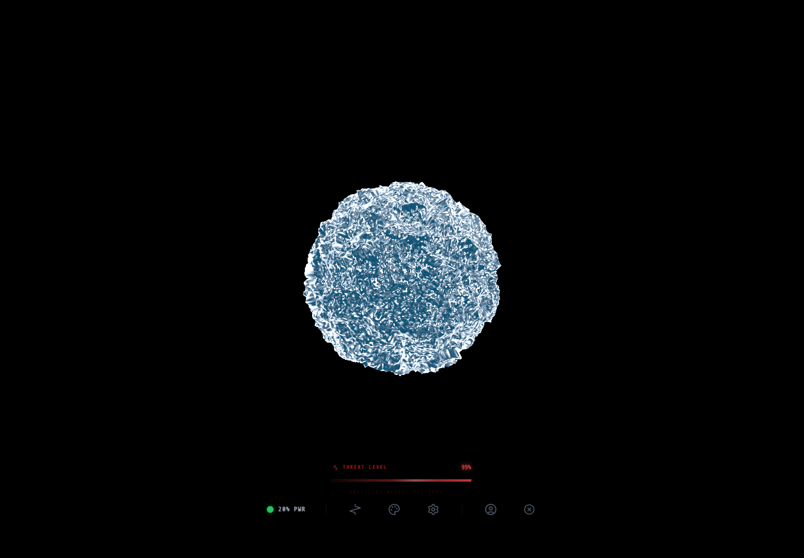

# Orbe SkyIA

## Rapport complet

Ce depot public presente le concept, les fonctions, les choix de conception, les outils utilises, les commandes locales et les captures d'ecran de l'application. Il est genere par l'orchestrateur uniquement apres validation de publication publique.

## Concept

Prototype immersif de SkyIA avec orbe WebGL, selection de modeles, modes chat/jeu, voix, credits, sauvegardes et statistiques.

Explorer une experience SkyIA plus visuelle, vivante et memorisable.

Public vise: Prototype interne et experimentation d'interface IA.


## Fonctionnement de l'application

L'application demarre un noyau SkyIA, prepare le backend, charge les modeles disponibles, gere les protocoles de partie, puis route les messages vers les services IA. Les composants gerent le profil, les sauvegardes, le magasin, les rapports, l'installation et le rendu WebGL de l'orbe. Les services audio ajoutent reconnaissance vocale, analyse micro, filtres, synthese vocale et visualisation.

## Fonctions de l'application

- Met en scene SkyIA sous forme d'orbe interactif.
- Permet de choisir des modeles et protocoles de jeu.
- Teste voix, audio, sauvegardes, credits et statistiques.
- Reste bloque cote diffusion tant que la securite n'est pas OK.
- Discuter avec SkyIA en mode immersif
- Choisir des modeles et protocoles
- Utiliser un mode chat ou jeu
- Activer la voix et la synthese vocale
- Sauvegarder et reprendre une session
- Consulter des rapports de fin de partie
- Gerer profil, credits et magasin
- Explorer des modeles OpenRouter

## Actualisations et evolution

- Statut courant: PUBLIC_READY.
- Securite: OK_PUBLIC.
- Fonctionnement: FONCTIONNEL.

## Options et conception

Le projet a ete concu comme laboratoire d'experience IA: meme logique de jugement et de modeles que SkyIA, mais avec une interface plus expressive. La partie visuelle, la voix, les credits et les sauvegardes servent a tester ce qui peut rendre l'assistant plus present et engageant.

### Outils, IA et moteurs utilises

- Gemini
- Gemini Live
- OpenRouter model discovery
- Firebase/Firestore
- Fonctions cloud Firebase
- Stripe checkout
- Web Speech API
- Proxy TTS
- Analyse micro et filtres audio
- Orbe WebGL
- React/Vite
- TypeScript
- Three.js/WebGL
- Services Gemini et Gemini Live
- Firebase/Firestore et fonctions cloud
- Synthese vocale proxy TTS
- localStorage pour preferences et sessions

### Options techniques detectees

- Type de projet: node
- Gestionnaire: npm
- Nom package: skyia:-judgment-protocol-27.11.2025
- Version: 0.0.0
- Lien public: https://orbe.skyia.net/
- Statut securite: OK_PUBLIC

### Stack et dependances principales

- Vite/Dev server
- React
- Three.js/WebGL
- Node.js
- React/Vite
- TypeScript
- Services Gemini et Gemini Live
- OpenRouter model discovery
- Firebase/Firestore et fonctions cloud
- Stripe checkout
- Web Speech API
- Synthese vocale proxy TTS
- localStorage pour preferences et sessions

### Scripts disponibles

- build: vite build
- check: node --max-old-space-size=8192 ./node_modules/typescript/bin/tsc --noEmit
- dev: vite
- preview: vite preview
- start: node server.cjs
- test: vitest

### Dependances applicatives

- @react-three/drei ^10.7.7
- @react-three/fiber ^9.5.0
- @react-three/postprocessing ^3.0.4
- dotenv ^17.3.1
- framer-motion ^12.34.3
- html2canvas 1.4.1
- jspdf ^4.2.1
- lucide-react ^0.554.0
- postprocessing ^6.38.3
- react ^19.2.0
- react-dom ^19.2.0
- recharts ^3.8.1
- three ^0.183.1

### Dependances de developpement

- @testing-library/jest-dom ^6.9.1
- @testing-library/react ^16.3.2
- @types/node ^22.19.11
- @vitejs/plugin-react ^6.0.2
- autoprefixer ^10.4.24
- jsdom ^28.0.0
- postcss ^8.5.6
- tailwindcss ^3.4.17
- ts-node ^10.9.2
- typescript ~5.8.2
- vite ^8.0.16
- vitest ^4.0.18

## Automatisations et comportements internes

- Warm-up du backend au demarrage
- Decouverte des modeles OpenRouter
- Chargement et filtrage des modeles
- Sauvegarde locale et Firestore des sessions
- Statistiques de parties via fonctions cloud
- Gestion des credits et codes promo
- Checkout Stripe
- Export PDF de rapports
- Filtres audio et TTS automatises
- Tests de securite et de composants

## Installation locale

```powershell
npm install
```

## Lancement

```powershell
npm run dev
npm run start
npm run build
```

## Captures d'ecran




## Variables d'environnement

Copier `.env.example` vers `.env` en local puis remplir les valeurs privees.

## Securite

Ne jamais publier `.env`, tokens, sessions, logs sensibles, cles privees ou donnees personnelles.
