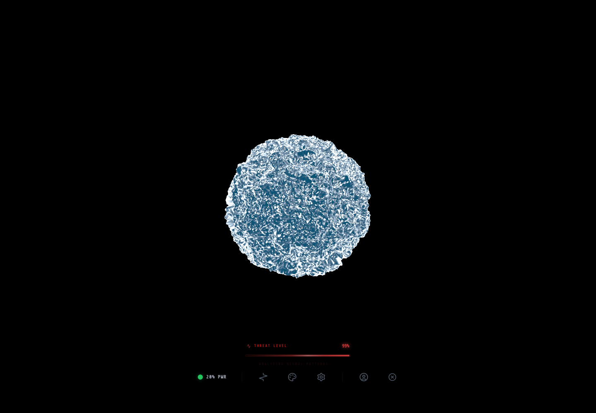

# Orbe SkyIA - Prototype immersif d'interface IA

## Rapport complet

Ce depot public presente le concept, les fonctions, les choix de conception, les outils utilises, les commandes locales et les captures d'ecran de l'application. Il est genere par l'orchestrateur uniquement apres validation de publication publique.

## Concept

Prototype expérimental transformant l'assistant SkyIA en une expérience visuelle et interactive via une orbe WebGL, intégrant voix, sauvegardes et statistiques.

Fournir un laboratoire d'innovation pour concevoir une interface IA plus expressive, immersive et mémorable que les assistants textuels traditionnels, tout en testant des fonctionnalités avancées comme la reconnaissance vocale, la synthèse vocale et la gestion de sessions persistantes.

Public vise: Équipe de développement, designers UX, chercheurs en IA et partenaires techniques souhaitant explorer des interfaces IA innovantes ou tester des fonctionnalités avancées avant intégration dans des produits finaux.


## Fonctionnement de l'application

L'application démarre un serveur Node.js qui initialise les services Firebase (Auth, Firestore) et prépare l'environnement d'exécution. Le frontend React, construit avec Vite, charge les composants principaux (orbe WebGL, interface de chat, tableaux de bord) et établit une connexion avec les services IA via OpenRouter ou l'API Google. Les interactions vocales sont gérées par la Web Speech API, tandis que les sauvegardes sont stockées localement ou synchronisées avec Firestore. Les crédits sont vérifiés via Stripe, et les rapports de session sont générés dynamiquement en PDF. L'orbe 3D réagit aux messages de l'IA et aux actions utilisateur, créant une boucle de feedback visuel.

## Fonctions de l'application

- Visualisation interactive de l'assistant IA sous forme d'orbe WebGL
- Sélection de modèles IA parmi une liste de fournisseurs (OpenRouter)
- Mode conversationnel immersif avec gestion de contexte
- Intégration de la voix (reconnaissance et synthèse) via Web Speech API
- Système de sauvegarde et de restauration de sessions locales ou cloud
- Gestion des crédits et achats via Stripe
- Génération de rapports de session exportables en PDF
- Tableau de bord de statistiques utilisateur
- Rendu 3D temps réel de l'orbe SkyIA avec réactions aux messages
- Sélection dynamique de modèles IA parmi une liste de fournisseurs (OpenRouter)
- Reconnaissance vocale et synthèse vocale via Web Speech API
- Sauvegarde et restauration de sessions (localStorage ou Firestore)
- Gestion des crédits utilisateur avec intégration Stripe
- Génération de rapports de session en PDF
- Tableau de bord de statistiques utilisateur (victoires, défaites, crédits consommés)
- Interface de configuration pour personnaliser l'expérience
- Effets visuels immersifs (CRT, arrière-plan défilant)
- Gestion des profils utilisateur avec synchronisation Firestore

## Actualisations et evolution

- Correction des règles de sécurité Firestore pour éviter les erreurs de permission lors de l'écriture des profils utilisateurs
- Ajout d'un mécanisme d'auto-réparation pour les documents utilisateurs incomplets
- Optimisation des performances du rendu WebGL avec Three.js
- Mise à jour des dépendances pour compatibilité avec React 19 et TypeScript 5.8
- Documentation complète des procédures de maintenance et de débogage
- Statut courant: NEEDS_REPAIR.
- Securite: OK_PUBLIC.
- Fonctionnement: NON_FONCTIONNEL_REPARABLE.
- [object Object]

## Comment le projet a ete reflechi et construit

Le projet a été conçu comme un laboratoire d'innovation pour les interfaces IA, avec une architecture modulaire séparant clairement les responsabilités : frontend (React + Three.js), backend (Node.js + Firebase), services externes (IA, voix, paiements) et gestion d'état (React Context). Les choix clés incluent l'utilisation de Three.js pour le rendu 3D afin de garantir une expérience fluide, l'intégration de Firebase pour une gestion centralisée des utilisateurs et des sessions, et l'adoption de TypeScript pour une robustesse accrue. L'interface a été pensée pour être intuitive malgré sa complexité, avec des effets visuels (CRT, arrière-plan) servant à renforcer l'immersion sans distraire de la fonction principale. La sécurité a été renforcée via des règles Firestore strictes et des mécanismes d'auto-réparation pour les documents utilisateurs.

Cette section doit expliquer les choix qui ont guide le projet: besoin de depart, structure retenue, modules principaux, compromis techniques, interface ou logique metier, et raisons des outils utilises.

### Outils, IA et moteurs utilises

- Vite (outil de build et serveur de développement)
- React (bibliothèque frontend)
- Three.js (rendu 3D WebGL)
- Firebase (Auth, Firestore, Functions)
- OpenRouter (accès aux modèles IA)
- Stripe (gestion des paiements)
- Web Speech API (reconnaissance et synthèse vocale)
- jspdf (génération de PDF)
- Recharts (visualisation de données)
- Tailwind CSS (styling)
- Architecture modulaire (frontend/backend/services)
- Gestion d'état avec React Context
- Rendu 3D avec Three.js et React Three Fiber
- Intégration d'API externes (IA, voix, paiements)
- Persistance des données (localStorage, Firestore)
- TypeScript pour la robustesse du code
- Tests unitaires avec Vitest
- Optimisation des performances (WebGL, lazy loading)

### Options techniques detectees

- Type de projet: node
- Gestionnaire: npm
- Nom package: skyia:-judgment-protocol-27.11.2025
- Version: 0.0.0
- Lien public: https://orbe.skyia.net/
- Statut securite: OK_PUBLIC

### Stack et dependances principales

- Vite/Dev server
- React
- Three.js/WebGL
- Node.js
- Architecture modulaire (frontend/backend/services)
- Gestion d'état avec React Context
- Rendu 3D avec Three.js et React Three Fiber
- Intégration d'API externes (IA, voix, paiements)
- Persistance des données (localStorage, Firestore)
- TypeScript pour la robustesse du code
- Tests unitaires avec Vitest
- Optimisation des performances (WebGL, lazy loading)

### Scripts disponibles

- build: vite build
- check: node --max-old-space-size=8192 ./node_modules/typescript/bin/tsc --noEmit
- dev: vite
- preview: vite preview
- start: node server.cjs
- test: vitest

### Dependances applicatives

- @react-three/drei ^10.7.7
- @react-three/fiber ^9.5.0
- @react-three/postprocessing ^3.0.4
- dotenv ^17.3.1
- framer-motion ^12.34.3
- html2canvas 1.4.1
- jspdf ^4.2.1
- lucide-react ^0.554.0
- postprocessing ^6.38.3
- react ^19.2.0
- react-dom ^19.2.0
- recharts ^3.8.1
- three ^0.183.1

### Dependances de developpement

- @testing-library/jest-dom ^6.9.1
- @testing-library/react ^16.3.2
- @types/node ^22.19.11
- @vitejs/plugin-react ^6.0.2
- autoprefixer ^10.4.24
- jsdom ^28.0.0
- postcss ^8.5.6
- tailwindcss ^3.4.17
- ts-node ^10.9.2
- typescript ~5.8.2
- vite ^8.0.16
- vitest ^4.0.18

## Automatisations et comportements internes

- Warm-up automatique du backend au démarrage
- Découverte dynamique des modèles IA disponibles via OpenRouter
- Sauvegarde automatique des sessions utilisateur
- Génération automatique de rapports de session
- Vérification des crédits utilisateur avant interaction IA
- Synchronisation des profils utilisateur avec Firestore
- Tests de sécurité et de compatibilité au build

## Installation locale

[object Object]

### Pre-requis
- Node.js installe localement.
- Gestionnaire detecte: npm.
- Creer un fichier `.env` local a partir de `.env.example` si des variables sont necessaires.

### Commandes
```powershell
npm install
npm run build
npm run dev
npm run start
```

### Scripts utiles
- build: vite build
- check: node --max-old-space-size=8192 ./node_modules/typescript/bin/tsc --noEmit
- dev: vite
- preview: vite preview
- start: node server.cjs
- test: vitest

## Lancement

```powershell
npm run dev
npm run start
npm run build
```

## Utilisation

Après installation, l'application est accessible via un navigateur à l'adresse `http://localhost:5173` (mode développement). L'utilisateur peut se connecter via Google ou email, puis interagir avec l'orbe SkyIA en mode conversationnel ou jeu. Les fonctionnalités incluent la sélection de modèles IA, l'activation de la voix pour les entrées/sorties, la sauvegarde de sessions, l'achat de crédits, et la consultation de rapports. L'interface propose des effets visuels dynamiques (lignes CRT, arrière-plan défilant) pour renforcer l'immersion. Pour une expérience complète, il est recommandé d'utiliser un navigateur moderne (Chrome, Firefox) avec WebGL activé.

## Captures d'ecran




## Variables d'environnement

Copier `.env.example` vers `.env` en local puis remplir les valeurs privees.

## Securite

Ne jamais publier `.env`, tokens, sessions, logs sensibles, cles privees ou donnees personnelles.
