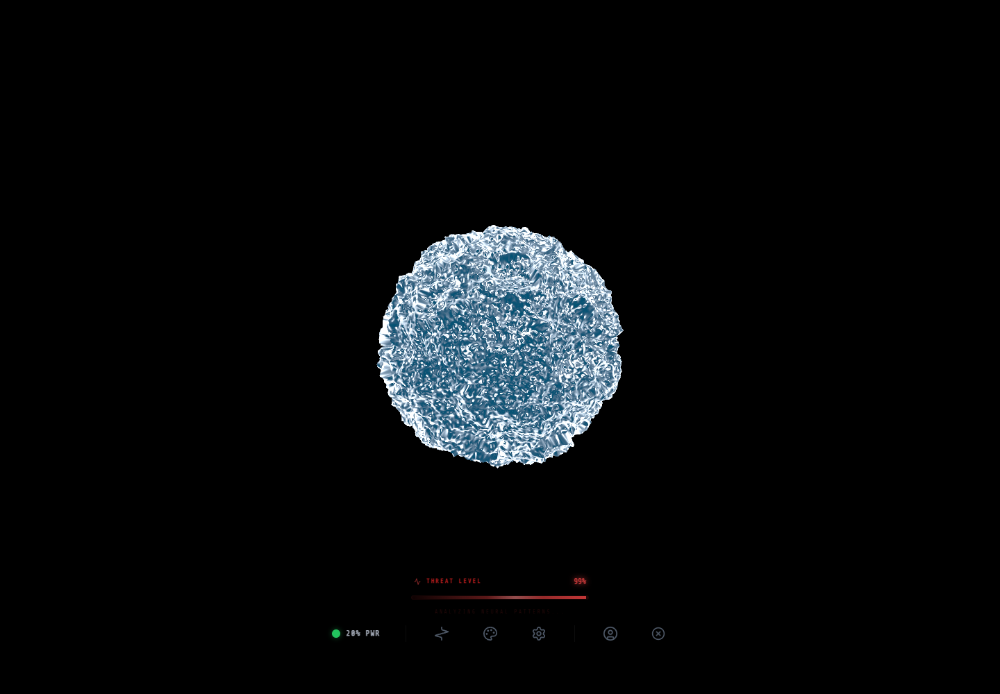

# Orbe SkyIA

Prototype immersif de SkyIA avec orbe WebGL, selection de modeles, modes chat/jeu, voix, credits, sauvegardes et statistiques.

## Objectif

Explorer une experience SkyIA plus visuelle, vivante et memorisable.

## Fonctions principales

- Met en scene SkyIA sous forme d'orbe interactif.
- Permet de choisir des modeles et protocoles de jeu.
- Teste voix, audio, sauvegardes, credits et statistiques.
- Reste bloque cote diffusion tant que la securite n'est pas OK.

## Installation locale

```powershell
npm install
```

## Lancement

```powershell
npm run dev
npm run start
npm run build
```

## Captures d'ecran




## Variables d'environnement

Copier `.env.example` vers `.env` en local puis remplir les valeurs privees.

## Securite

Ne jamais publier `.env`, tokens, sessions, logs sensibles, cles privees ou donnees personnelles.
